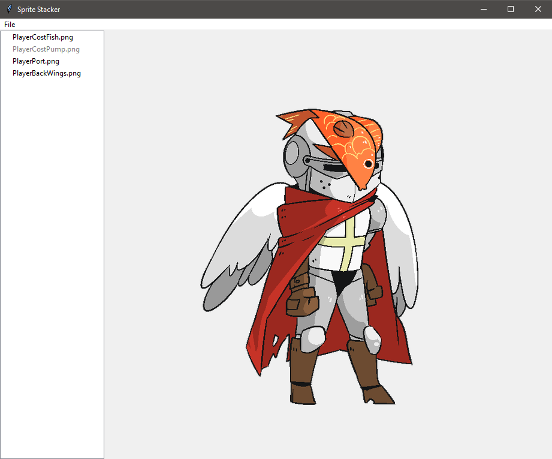

# sprite-stacker

A simple tool to stack transparent sprite parts on top of each other to get the full sprite. Useful for some game assets.

## Features

* Drag and drop interface for importing images easily.
* Simple rearrangement and organization of images with a reactive preview.
* Preview area to see the final picture.
* Export functionality for the combined images.



## Installation

### Method 1: Executable file

1. Navigate to the [Releases](https://github.com/xHarlock/sprite-stacker/releases) tab of this repository.
2. Go to the latest release and download the `.exe` file.
3. Running the `.exe` file makes the window of the tool pop up.

### Method 2: Terminal

Before you begin, ensure you have met the following requirements:

* Python 3.10 or higher installed.
* Access to terminal or command prompt.

Once you fulfill all of them, you can start with the installation.

1. Clone the repository:

```bash
git clone https://github.com/xHarlock/sprite-stacker.git
cd sprite-stacker
```

2. Install dependencies:

```bash
pip install requirements.txt
```

3. After the installation has finished, you can run the application using the following command:

```bash
python src/main.py
```

### Usage

1. **Import images:** Drag and drop your sprite images into the application window or use the 'Add images' option in the 'File' menu.
2. **Arrange sprites:** Click and drag to rearrange the sprites in the desired order. Note that the top most sprite will be shown on top of all the other sprites in the final image.
3. **Disable layers:** By double-clicking on individual layers, they can be disabled and thus be hidden from the preview and the final image.
4. **Preview stacked sprites:** The right area shows a live preview of the stacked sprites.
5. **Export image:** Use the 'Save' option in the 'File' menu to export the combined sprite image.

## Contributing

Contributions are always welcome and greatly appreciated. Simply fork the repository, apply your changes, and create a Pull Request.

## License

This project is licensed under the MIT License. See [LICENSE](LICENSE) for more details.
